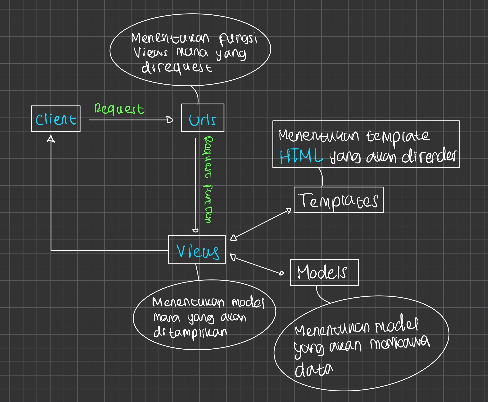

Name        : Ardian

NPM         : 2106638173

Project     : Tugas 1

1. 

2. Virtual environment ini kita gunakan untuk mengisolasikan package serta dependencies dari aplikasi yang kita buat agar tidak bertabrakan dengan versi lain yang ada pada komputer kita. Web berbasis Django masih bisa dijalankan tanpa virtual environment, namun, hal ini bukanlah best practice dan sebaiknya dihindari, dikarenakan web berbasis Django bergantung pada dependencies atau tertentu yang berbeda untuk masing-masing project sehingga dengan tidak menggunakan virtual environment akan menimbulkan masalah-masalah yang tentu tidak kita inginkan.

3. Saya megimplementasikan poin 1-4 dengan cara mengikuti tahap-tahap yang dilakukan di tutorial 1 dengan menyesuaikan permintaan tugas 1 ini. Dan juga, sebelum melaksanakan poin 1-4, saya juga membuat repository GitHub baru khusus untuk tugas PBP.